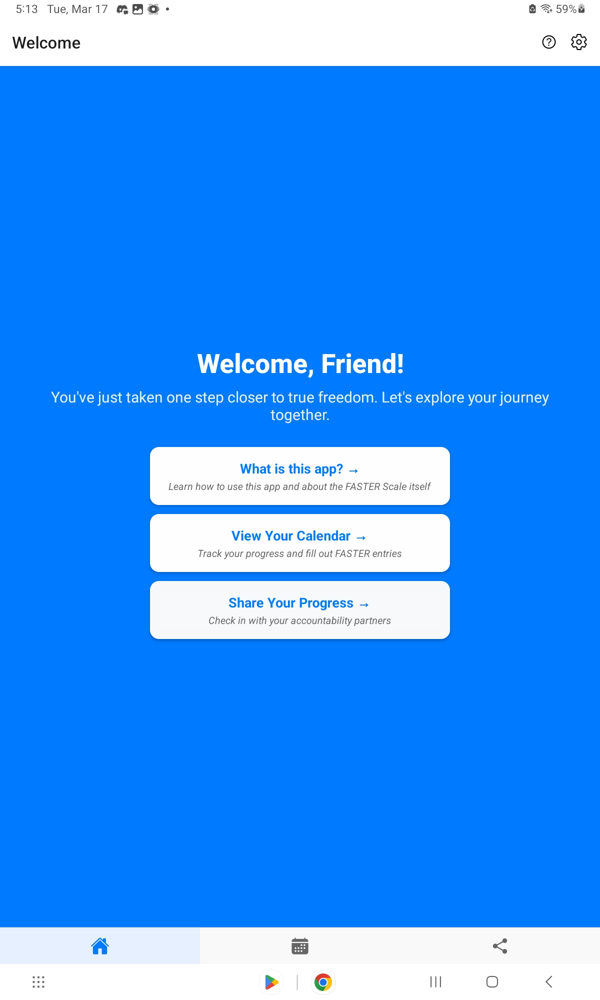
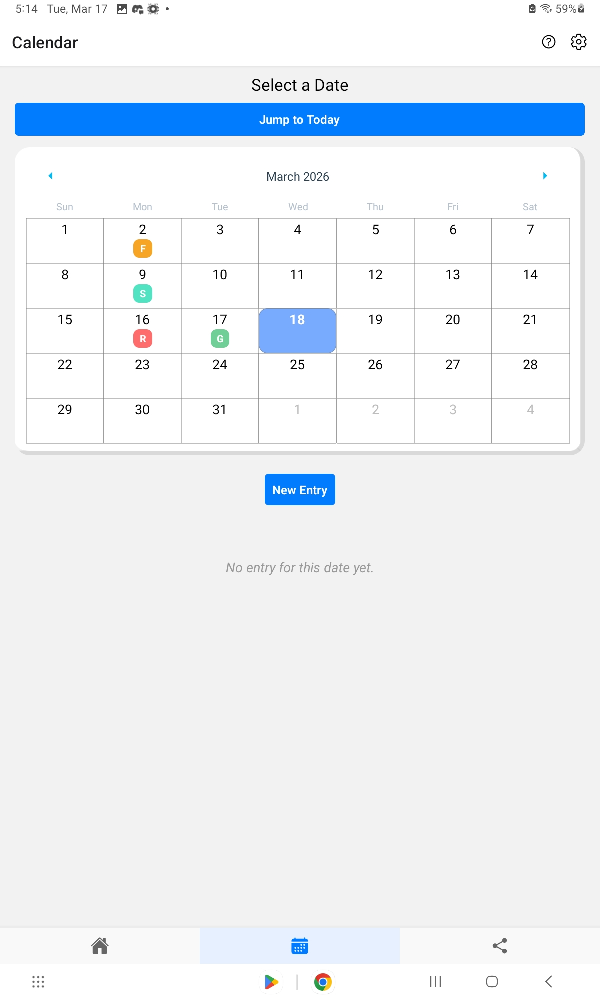
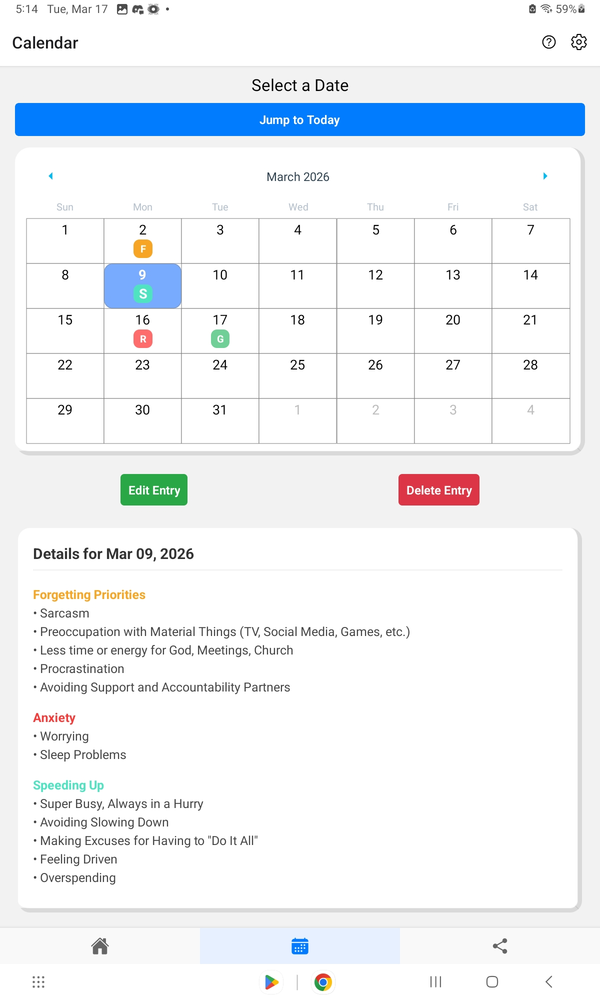
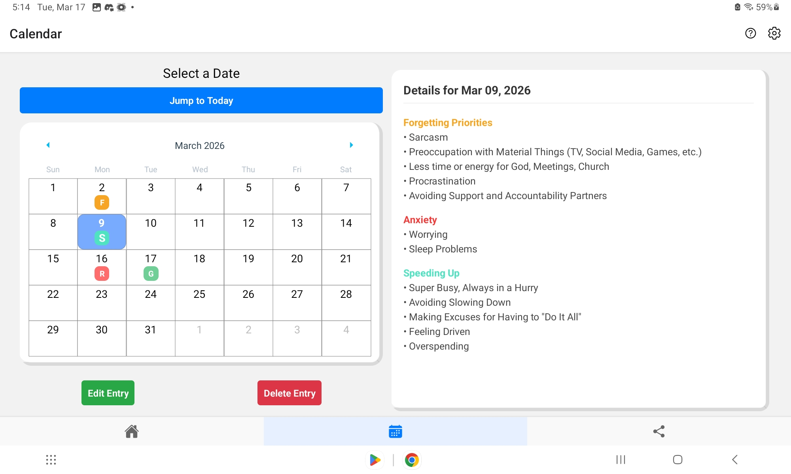
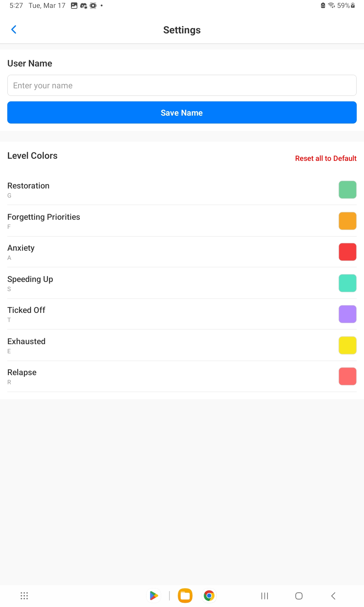

<!--
//----Useful CLI Commands----//
npx expo start = launch build environment
eas build --platform android --profile test = build installable apk
adb logcat \*:S ReactNative:V ReactNativeJS:V = debug apk
-->

# FASTER Scale Mobile App

_This app is based off of the FASTER Scale created by Pure Desire Ministries. I am not affiliated in any way with Pure Desire, and the content of this app has not been officially licensed or endorsed by Pure Desire (yet)._

### **This app is a work in progress. Any part of it is liable to change during the development process. Use at your own discretion**

## Overview

&nbsp;&nbsp;&nbsp;&nbsp;The FASTER\* Mobile Tracker, henceforth referred to as “app,” is designed to be an accountability tool to help those on the path to recovery from addiction. The content itself is largely based on the FASTER Scale created and used by Pure Desire in their recovery curriculums. This app is designed to be an easy way for people to access and maintain a log of their FASTER Scale entries on their cell phones or tablets that can be easily shared with their accountability partners.

&nbsp;&nbsp;&nbsp;&nbsp;I am building this app because I feel it would be useful in my own recovery journey, and when bringing up the idea to my own accountability partners, they have expressed interest as well, so I feel like the audience is definitely there.

- FASTER is an acronym that stands for “Forgetting Priorities,” “Anxiety,” “Speeding Up,” “Ticked Off,” “Exhausted,” and “Relapse.” These seven levels are supposed to help a recovering addict figure out what their current mental state is, and pinpoint how they can get back to living in “Restoration” (the silent, invisible ‘R’ at the beginning of FASTER).

## Installation

&nbsp;&nbsp;&nbsp;&nbsp;You can find the latest APK in [Releases](https://github.com/Imagination-King/faster-app/releases). Simply download it and install it on your preferred (Android) device. Ignore any warnings about untrusted apps, though you're free to let your device scan the app if you want to. I promise I haven't included any viruses.

There is currently no support for iOS devices, though I do plan on adding it at some point.

## Features

Current

<ul>
  <li> Add, edit, and delete FASTER entries for any day
  <li> View all your entries in a nice, color-coordinated Calendar-style view
  <li> Change the colors used to represent each level of the FASTER scale (you can also reset them back to their default values)
  <li> Set a custom username (that currently does nothing)
</ul>

Planned

<ul>
  <li> View statistics of your progress
  <li> Share your progress with whoever you want
  <li> Review entries of those who have shared with you
  <li> Export individual entries as PDFs
  <ul>
    <li> Export entire month or year as PDF?
  </ul>
  <li> Additional features as I think of them
<ul>

## Feedback

&nbsp;&nbsp;&nbsp;&nbsp;Please send your feedback! It is much appreciated!

&nbsp;&nbsp;&nbsp;&nbsp;I do, at some point, plan on including a built-in feedback feature, but for now, feel free to reach out to me with any questions, concerns, reviews, whatever. You should be able to find my email in my GitHub profile, but if you can't find it (or don't want to go to the effort), then it's alexhamilton.code@gmail.com

## Screenshots

